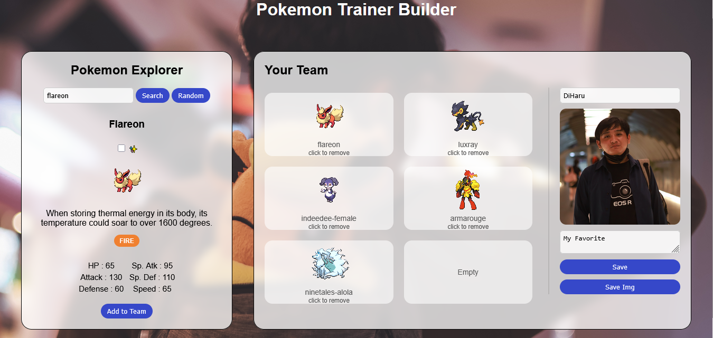
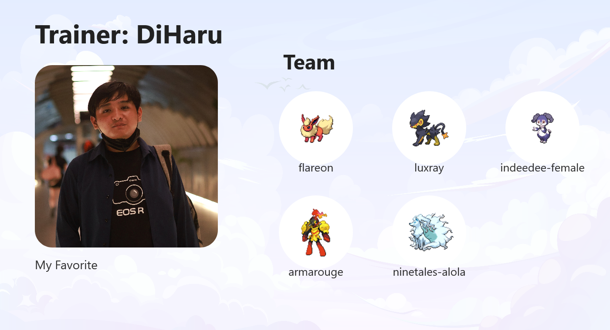

# Pokemon Trainer Page

"Simple web app that able to explore pokemon, build team, and saving trainer card"

This project is a fun small web app with HTML+CSS+JS and PokeAPI.

## Overview
Pokemon is worldwide beloved and famous title. Creating team is essential in pokemon and this web app allow not only that but also to export them as trainer card while exploring pokemon to add into the team.

## Feature
1. Search Pokemon by name
2. View Pokedex entry, Base Stats, Typing, and Sprite
3. Random Pokemon 
4. Guess the randomized Pokemon
5. Shiny toggle
6. Build a team of 6
6. Save trainer profile
7. Export trainer card

## Output

- Web Preview

<p align="center">
  
</p>

- Trainer Card

<p align="center">
  
</p>


## Project Structure
```
pokemon-trainer-page/
|-assets/
   |bg.jpg
   |explorer.png
   |placeholder.jpg
   |trainer-card.png
|-autocomplete.js
|-script.js
|-trainerCard.js
|-index.html
|-style.css
|-README.md
```

## How to Run
Open `index.html` to start.

## Tech Stack
- HTML + CSS + JS
- PokeApi (https://pokeapi.co/)

## Closing
While this project made for fun, it also built to practice:
- Working with REST APIs
- Handling async Javascript (fetch, async, await)
- Using LocalStorage
- Generate images using HTML Canvas
- Create working interactive UI with vanilla tech stack / no framework

## Future Improvement
- More mini games
- Pokemon battle simulation
